# ForgeLoop — Verifiable Engineering Protocol

[](https://github.com/cassiomc1/forgeloop/actions/workflows/docs-quality.yml)

ForgeLoop is a portable, vendor-neutral protocol for AI-assisted development
and developer workflows. It turns an outcome into a contract, deterministic
routing, resumable state, evidence-backed verification, recovery, cross-harness
continuity, and validator-backed completion. It is a protocol/support CLI, not
an agent or LLM runtime, not an agent framework, and not a graph orchestrator.

The operational sources are indexed in [`DOCS_INDEX.md`](./DOCS_INDEX.md).
[`LOOP_ENGINEERING.md`](./LOOP_ENGINEERING.md) is the canonical process;
[`PROTOCOL_INTEGRATION.md`](./PROTOCOL_INTEGRATION.md) defines capability
levels and discovery; [`PROJECT_PROFILE.md`](./PROJECT_PROFILE.md) stores
durable project facts; and [`GUIDE_ROUTER.md`](./GUIDE_ROUTER.md) selects only
relevant guides.

## Where should I start?

- **New to ForgeLoop** → [`docs/GETTING_STARTED.md`](./docs/GETTING_STARTED.md)
- **Full protocol specification** → [`LOOP_ENGINEERING.md`](./LOOP_ENGINEERING.md)
- **Integrating an AI harness** → [`PROTOCOL_INTEGRATION.md`](./PROTOCOL_INTEGRATION.md)
- **Continuing another harness's task** → [`docs/CROSS_HARNESS_CONTINUITY.md`](./docs/CROSS_HARNESS_CONTINUITY.md)
- **CLI command reference** → [`docs/CLI_REFERENCE.md`](./docs/CLI_REFERENCE.md)
- **Artifact & schema reference** → [`docs/ARTIFACT_REFERENCE.md`](./docs/ARTIFACT_REFERENCE.md)
- **Operational recipes** → [`docs/RECIPES.md`](./docs/RECIPES.md)
- **Troubleshooting & error codes** → [`docs/TROUBLESHOOTING.md`](./docs/TROUBLESHOOTING.md)
- **System architecture & safety** → [`LOOP_SYSTEM_DESIGN.md`](./LOOP_SYSTEM_DESIGN.md) & [`THREAT_MODEL.md`](./THREAT_MODEL.md)
- **Documentation index & ownership** → [`DOCS_INDEX.md`](./DOCS_INDEX.md)

## Catalog

| Topic | Guide |
| --- | --- |
| Premium websites | [`ENG/premium-sites-studio-eng.md`](./ENG/premium-sites-studio-eng.md) |
| Clean code | [`ENG/clean-code-eng.md`](./ENG/clean-code-eng.md) |
| Testing | [`ENG/test-code-eng.md`](./ENG/test-code-eng.md) |
| Security | [`ENG/sec-code-eng.md`](./ENG/sec-code-eng.md) |
| Design and UX | [`ENG/design-code-eng.md`](./ENG/design-code-eng.md) |
| Taste frontend | [`ENG/taste-frontend-eng.md`](./ENG/taste-frontend-eng.md) |
| Performance | [`ENG/perf-code-eng.md`](./ENG/perf-code-eng.md) |
| Accessibility | [`ENG/accessibility-eng.md`](./ENG/accessibility-eng.md) |
| Web games | [`ENG/games-code-design-web-eng.md`](./ENG/games-code-design-web-eng.md) |
| Documentation quality | [`ENG/documentation-quality-eng.md`](./ENG/documentation-quality-eng.md) |

Each guide declares its name, language, version, and review date in
frontmatter. Repository validators keep the catalog and metadata synchronized.

## Quickstart

From a published package, initialize a target project with:

```bash
npx @cassiomc1/forgeloop init
npx @cassiomc1/forgeloop doctor
```

The CLI installs canonical documents under `.forgeloop/kit/`, keeps small
native discovery shims at the project root, and stores mutable contract, route,
gate, state, event, receipt, and execution artifacts under `.forgeloop/`.
`update` preserves target-specific profile facts and locally modified files.

Before npm publication, the same source checkout can be exercised without a
network or package lookup:

```bash
node src/cli.js init
node src/cli.js doctor
node src/cli.js update
```

## Universal project loop

The lifecycle is:

```text
request → discovery → contract → routing → plan → execution
        → verification → review → completion validation
              ↑                         │
              └──── evidence-only rejection / next cycle
```

The harness writes a schema-valid `.forgeloop/current-contract.json`, required
gate artifacts, and routing. `preflight` must return `PREFLIGHT_READY` before
implementation. ForgeLoop then records an append-only event ledger and protects
the lifecycle with contract, route, repository, and artifact fingerprints.

Typical local commands are:

```bash
forgeloop route --work complete-website --surface ui --risk untrusted-input
forgeloop activate
forgeloop preflight --json
forgeloop next --json
forgeloop advance --to PLANNED
forgeloop advance --to EXECUTING
forgeloop advance --to VERIFYING
forgeloop prepare-completion --json
forgeloop run-check --json --id tests --requirement tests -- npm test
forgeloop advance --to REVIEWING
forgeloop audit --json
forgeloop complete --json
```

`advance` changes protocol phase only; it never runs target commands.
`run-check` classifies the exact argv before launch and records ForgeLoop-owned
execution provenance. `record-check` stores an observation and never executes
the text supplied to `--command`. `complete` validates the contract, route,
gates, ledger, evidence, coverage, receipt, and freshness. `audit` is
read-only. `report` exposes independent completion, publication, and
production-readiness dimensions.

The status precedence is `INVALID` > `INCONSISTENT` > `STALE` > `INCOMPLETE` >
`VALID`. A `READY` preflight is a resumable checkpoint: if its work state is
missing, `forgeloop next` returns `RESOLVE_BLOCKER` rather than silently
falling back to discovery. Delegation artifacts are required only when
delegation is present in the execution history; ForgeLoop does not provide a
graph runtime, agent runtime, or hidden prompt store.

### Cross-harness continuity

ForgeLoop preserves task state when switching between AI coding tools, IDEs, or terminals:

```bash
forgeloop status --json
forgeloop continuity --json
forgeloop reconcile-continuity --json
forgeloop next --json
```

See [`docs/CROSS_HARNESS_CONTINUITY.md`](./docs/CROSS_HARNESS_CONTINUITY.md) for full handoff and recovery procedures.

### Multi-task concurrent project state

ForgeLoop supports isolated, concurrent tasks within the same repository via deterministic SHA-256 namespacing, per-task mutex locking, and write-claim conflict detection:

```bash
# Create an isolated task claiming specific directories
forgeloop task-create --task auth-feature --claim src/auth --claim tests/auth --json

# List active and completed tasks
forgeloop task-list --json

# Run standard lifecycle commands targeting the task
forgeloop route --task auth-feature --work clean-code --surface backend
forgeloop preflight --task auth-feature --json
forgeloop advance --task auth-feature --to EXECUTING
forgeloop complete --task auth-feature --json

# Migrate legacy 1.0 single-task layout
forgeloop task-migrate --json
```

See [`docs/CLI_REFERENCE.md`](./docs/CLI_REFERENCE.md) and [`LOOP_SYSTEM_DESIGN.md`](./LOOP_SYSTEM_DESIGN.md) for architecture details.

## Architecture flow

The canonical source is [`docs/forgeloop-flow.mmd`](./docs/forgeloop-flow.mmd),
and the committed render is [`docs/assets/forgeloop-flow.svg`](./docs/assets/forgeloop-flow.svg).
The broader architecture and boundaries are in
[`LOOP_SYSTEM_DESIGN.md`](./LOOP_SYSTEM_DESIGN.md).

<p align="center">
  
</p>

Text-only fallback: discovery creates the contract and route; required gates
and `PREFLIGHT_READY` authorize execution; verification creates structured
evidence; failures enter diagnosis and correction; review precedes
validator-backed completion. Drift reopens verification, and migration keeps
modified or unmanaged files for review. The terminal result is one of
`VALID`, `INCOMPLETE`, `STALE`, `INCONSISTENT`, or `INVALID`.

## Protocol compatibility

The npm package version is independent of protocol version. The current
serializable artifact contract is `schemaVersion: 1` and `protocolVersion: 1`.

- Patch releases preserve the v1 schemas, enums, transitions, and existing
  command contracts while correcting implementation defects.
- Minor releases preserve existing v1 artifacts and commands; they may add
  documentation, commands, guides, or an explicitly named schema.
- Major releases may change required fields, enums, transitions, or safety
  semantics and must document migration requirements with a protocol version
  change.

Consumers must reject unknown artifact fields rather than silently treating
unrecognized protocol data as valid. The compatibility marker is
[`tests/fixtures/compatibility/protocol-v1.json`](./tests/fixtures/compatibility/protocol-v1.json).

## Security and dependency boundary

The runtime uses Node built-ins only and does not install agents, providers,
plugins, remote services, or telemetry. Target paths and symlinks are bounded;
JSON is size/depth limited; manifests, schemas, receipts, and secret-like
values are checked; and install-capable verification requires trusted host
authority. See [`THREAT_MODEL.md`](./THREAT_MODEL.md) for the full inventory.

Development tooling is intentionally separate from runtime dependencies. The
repository policy allows only ESLint, c8, and Mermaid CLI as development
dependencies; `npm run dependency:policy` fails if runtime or unapproved
dependencies appear.

## Autonomous blind-run isolation

The repository does not claim a live blind conformance result for an external
harness. The isolated scenario is `TEST_NOT_STARTED`; do not reinterpret it as
a pass or failure. The compatible autonomous boundary is explicit:

```text
mandatory-approval workflows enabled: NO
external brainstorming hard gate enabled: NO
external design approval gate enabled: NO
subagents enabled: NO
delegation enabled: NO
```

An environment that requires those gates is `INCOMPATIBLE WITH AUTONOMOUS MODE`.
This constraint concerns the harness boundary and does not turn reversible
local product choices into blocking questions.

## Optional multimodal capabilities

[Qwen-MM-Plugins](https://github.com/QwenLM/Qwen-MM-Plugins) is an optional,
task-scoped capability extension. The agent checks native/callable support
first, installs only the smallest missing capability when authorized, and
verifies it before use. No API key is used by default for native image, video,
or document reading.

| Capability | Configuration |
| --- | --- |
| Vision, OCR, grounding, transcription, generation, and video memory | `DASHSCOPE_API_KEY` |
| Web and image search | `SERPER_API_KEY` |
| Segmentation through a SAM3 service | `SAM3_SERVER_URL` |
| Blender, FreeCAD, Office, browser-backed visualization, and `edu-agent` | System dependencies and upstream configuration; `edu-agent` TTS also needs `DASHSCOPE_API_KEY` |

Credentials belong in the process environment or the official Qwen
configuration file, never in Git, `.forgeloop/kit/PROJECT_PROFILE.md`, or
copied instruction files. ForgeLoop does not vendor Qwen code or install it
through `init`, `update`, or `doctor`.

## Cross-harness continuity

ForgeLoop can optionally persist bounded execution-continuity context for a
resumable task so another compatible harness can reconcile the current checkout
and continue without replacing the task contract. Continuity is operational
context only; it is never verification evidence or authority. See
[`EXECUTION_STATE.md`](./EXECUTION_STATE.md) and
[`LOOP_ENGINEERING.md`](./LOOP_ENGINEERING.md).

## Release and maintenance

The release workflow uses [npm trusted publishing](https://docs.npmjs.com/trusted-publishers)
through GitHub Actions OIDC. A `vX.Y.Z` tag must match `package.json`; after
publishing, verify the immutable release identity:

```bash
RELEASE_COMMIT="$(git rev-list -n1 vX.Y.Z)"
npm run release:identity -- --version X.Y.Z --release-commit "$RELEASE_COMMIT"
```

Only `RELEASE_IDENTITY_VALID` is sufficient. Publication, pull requests,
merges, releases, and deployments are external actions and are never inferred
from local test success.

When updating a target, preserve `.forgeloop/kit/PROJECT_PROFILE.md`, compare
adapters before replacement, and run the repository checks. Python validators
remain frozen CI-only compatibility tools; their scope and invocation are
documented in [`scripts/CI_VALIDATORS.md`](./scripts/CI_VALIDATORS.md).

```bash
npm ci
npm test
npm run lint
npm run coverage
npm run pack:check
npm run dependency:policy
npm run docs:flow
npm run docs:check
```

## Repository structure

```text
src/                    npm CLI and protocol implementation
schemas/                versioned artifact schemas
ENG/                    package-source engineering guides
docs/forgeloop-flow.mmd canonical Mermaid source
docs/assets/             committed diagram render
scripts/                checks, renderer, release identity, CI notes
tests/                  Node and Python regression coverage
.forgeloop/              local protocol ledger and mutable artifacts
DOCS_INDEX.md            documentation map and ownership boundaries
```

The source repository keeps canonical documents at the root. A bootstrapped
target uses the hidden kit layout; mutable protocol artifacts remain directly
under `.forgeloop/`.

For document ownership, guide routing, capability degradation, and integration
details, start at [`DOCS_INDEX.md`](./DOCS_INDEX.md).
