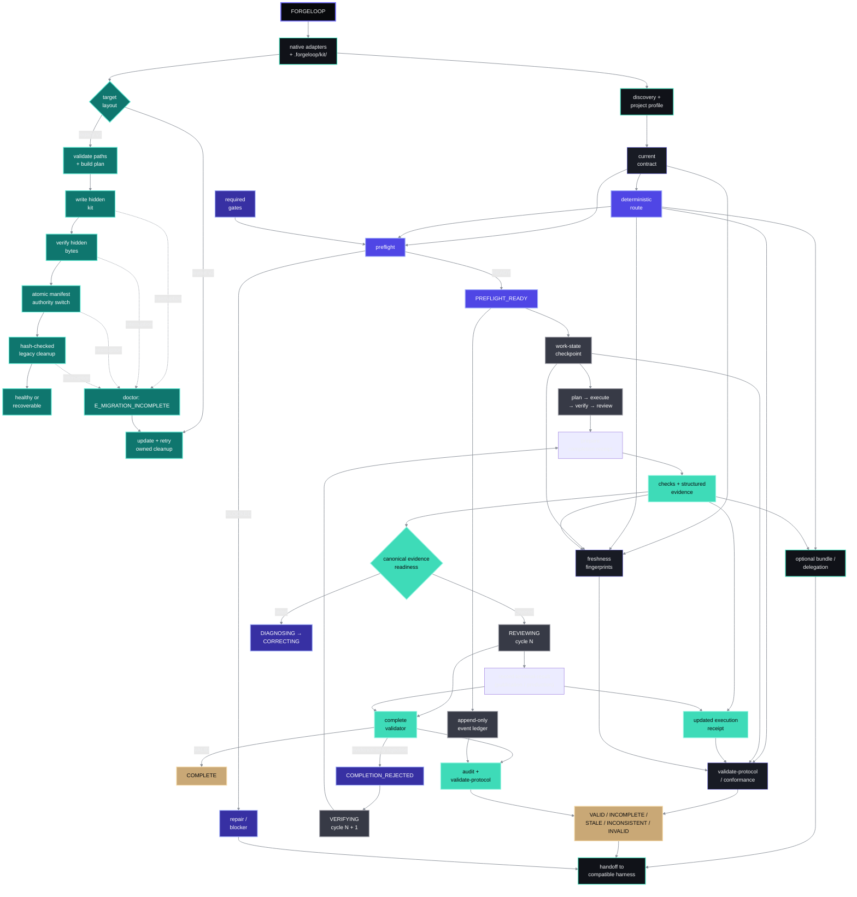

# ForgeLoop — Instruction Guides for AI Agents

[](https://github.com/cassiomc1/forgeloop/actions/workflows/docs-quality.yml)

An English-only collection of operational guides for AI agents and developers.
It covers product strategy, code, testing, security, performance,
accessibility, design, and web games across web, mobile, and desktop projects.

The files are Markdown and can be used as references, as a foundation for
`AGENTS.md`, `CLAUDE.md`, `.cursor/rules`, and
`.github/copilot-instructions.md`. The supported-agent contract is documented
in [`AGENT_COMPATIBILITY.md`](./AGENT_COMPATIBILITY.md). Adopt only the guides
relevant to the target project.

ForgeLoop is the portable, evidence-first loop that connects deterministic
routing, checkpointed state, observable evidence, conformance, and delegation
for compatible agent harnesses.

The npm package also ships the local `forgeloop` CLI. In a target project it
installs canonical documents under `.forgeloop/kit/`, keeps only small native
discovery shims at the root, and stores mutable protocol artifacts under
`.forgeloop/`.

## Catalog

| Topic | When to use it | Guide |
| --- | --- | --- |
| Premium websites | End-to-end process from strategy to launch | [`premium-sites-studio-eng.md`](./ENG/premium-sites-studio-eng.md) |
| Clean code | Readable, observable, secure, and operable code | [`clean-code-eng.md`](./ENG/clean-code-eng.md) |
| Testing | Risk-based testing strategy | [`test-code-eng.md`](./ENG/test-code-eng.md) |
| Security | Web, mobile, desktop, APIs, and supply chain | [`sec-code-eng.md`](./ENG/sec-code-eng.md) |
| Design | Visual direction, UX, motion, and perceived performance | [`design-code-eng.md`](./ENG/design-code-eng.md) |
| Taste frontend | Contextual design-read, anti-slop, and visual pre-flight for premium frontend work | [`taste-frontend-eng.md`](./ENG/taste-frontend-eng.md) |
| Performance | Measurement, diagnosis, budgets, and optimization | [`perf-code-eng.md`](./ENG/perf-code-eng.md) |
| Accessibility | WCAG 2.2-oriented protocol for interfaces | [`accessibility-eng.md`](./ENG/accessibility-eng.md) |
| Web games | Architecture, design, and operation of 2D, 3D, and procedural games | [`games-code-design-web-eng.md`](./ENG/games-code-design-web-eng.md) |

Each guide declares its name, `language: en`, description, version, and review
date in frontmatter. The repository validator checks that the guide metadata
and catalog remain synchronized.

## Universal project loop

The kit turns each request into a verifiable cycle: discover the project,
define an execution contract, select applicable guides, execute, verify,
diagnose, and correct until success or a genuine external blocker.
[`LOOP_ENGINEERING.md`](./LOOP_ENGINEERING.md) is the operational source (and
is installed under `.forgeloop/kit/` in a target);
[`GUIDE_ROUTER.md`](./GUIDE_ROUTER.md) prevents irrelevant context from being
loaded; and [`PROJECT_PROFILE.md`](./PROJECT_PROFILE.md) preserves only durable,
proven project facts (installed as `.forgeloop/kit/PROJECT_PROFILE.md` in a
target).

The canonical system map, including the routing/state/evidence architecture, is
in [`LOOP_SYSTEM_DESIGN.md`](./LOOP_SYSTEM_DESIGN.md).



Equivalent reading for text-only environments: adapters load the canonical kit;
an older target follows validate paths → write hidden files → verify their bytes
→ switch manifest authority atomically → hash-checked cleanup. An interruption
after hidden writes, after verification, after the authority switch, or during
cleanup is diagnosed by `doctor` as `E_MIGRATION_INCOMPLETE` and retried by
`update`; modified or unmanaged residual files remain preserved;
discovery creates the contract and deterministic route; contract, route, and
required gates must produce `PREFLIGHT_READY` before the resumable state and
append-only event ledger authorize the lifecycle. Verification produces
structured evidence evaluated by one canonical readiness model. Failed checks
enter diagnosis and correction. An evidence-only completion rejection records
`COMPLETION_REJECTED` and opens a new numbered verification cycle without
editing protocol JSON manually. `audit`, `complete`, and `validate-protocol`
classify the result as `VALID`, `INCOMPLETE`, `STALE`, `INCONSISTENT`, or
`INVALID`. Optional delegation creates a handoff; it is not an agent runtime.

The operational request loop remains:

```text
Request → discovery → profile → routing → plan → execution
        → verification → review → completion validation
              ↑             │
              └ evidence-only rejection / next cycle
```

Thin native adapters support Codex, Claude Code, Cursor, and GitHub Copilot.
Antigravity, OpenCode, Hermes, Pi, Command Code, and Freebuff use the shared
`AGENTS.md` entry point. All ten agents delegate to the same canonical
documents; see [`AGENT_COMPATIBILITY.md`](./AGENT_COMPATIBILITY.md) for the
official sources and precedence notes.

### Migration recovery and release freeze

Legacy layout migration keeps `.forgeloop/kit/` as the canonical layout and
does not make `layoutVersion: 2` authoritative until every planned hidden file
has been written and byte-verified. Cleanup runs only after the manifest switch
and only for legacy files whose recorded ownership hash still matches when
ForgeLoop revalidates it immediately before deletion. A modified, unmanaged,
or `preserve=true` file is retained for manual review.

The interruption vocabulary is test-only and is not a runtime state machine:

```text
VALIDATED → HIDDEN_WRITTEN → HIDDEN_VERIFIED → MANIFEST_SWITCHED
          → LEGACY_CLEANED → COMPLETE
```

The regression suite injects failures at these boundaries and verifies that
`doctor` explains the incomplete migration before a later `update` recovers
owned cleanup. The frozen published installation under
[`tests/fixtures/legacy-0.1.6/`](./tests/fixtures/legacy-0.1.6/) is derived
from the real npm tarball, includes provenance and digests, and is copied into
tests locally; CI does not download npm packages.

The current published baseline for a reproducible blind run is
`@cassiomc1/forgeloop@0.1.10`. Earlier `0.1.8` and `0.1.9` references are
historical; never move their tags or `v0.1.10`, and use the read-only release
identity verifier before a live run. Version `0.1.10` includes the
completion-validation and cleanup TOCTOU hardening.

The repository candidate is `0.1.11` and is not published. It adds canonical
evidence readiness, legal repeated verification cycles, future-result and
compound-evidence safeguards, and lifecycle-ledger divergence detection. The
published npm baseline remains `0.1.10` until a separate release is completed.

### Use with npm

The npm CLI targets Node.js 20 or newer and installs the kit into an existing
project without overwriting local instructions. When the package is available
in the npm registry, use the commands below; otherwise use the repository
checkout fallback.

The current published release is `@cassiomc1/forgeloop@0.1.10`.
Pin this version when a reproducible blind run or release-identity check is
required:

```bash
npx @cassiomc1/forgeloop@0.1.10 --version
npx @cassiomc1/forgeloop init
npx @cassiomc1/forgeloop doctor
npx @cassiomc1/forgeloop update
```

Protocol-support commands are local and do not invoke an agent or model:

The lifecycle example assumes that the harness has already written a
schema-valid `.forgeloop/current-contract.json` and the required
`.forgeloop/gates/*.json` files. `route` persists routing; `preflight` validates
the contract, route, and gates before execution.

```bash
npx @cassiomc1/forgeloop route --work complete-website --surface ui --risk untrusted-input
npx @cassiomc1/forgeloop activate
npx @cassiomc1/forgeloop preflight --json
npx @cassiomc1/forgeloop next
npx @cassiomc1/forgeloop next --json
npx @cassiomc1/forgeloop advance --to PLANNED
npx @cassiomc1/forgeloop advance --to EXECUTING
npx @cassiomc1/forgeloop advance --to VERIFYING
npx @cassiomc1/forgeloop prepare-completion --json
npx @cassiomc1/forgeloop record-check --id tests --requirement tests --status passed --evidence-kind OBSERVED --command "npm test" --result "exit 0" --exit-code 0 --json
npx @cassiomc1/forgeloop record-terminal-result --requirement "Package published" --type PUBLICATION --status published --source "npm publish" --result "Published package to npm" --json
npx @cassiomc1/forgeloop advance --to REVIEWING
npx @cassiomc1/forgeloop audit --json
npx @cassiomc1/forgeloop complete --json
npx @cassiomc1/forgeloop report
npx @cassiomc1/forgeloop policy web-premium
npx @cassiomc1/forgeloop bundle --task website-001 --json
npx @cassiomc1/forgeloop inspect --json
npx @cassiomc1/forgeloop status --json
npx @cassiomc1/forgeloop status --contract-file .forgeloop/current-contract.json --json
npx @cassiomc1/forgeloop validate-state --json
npx @cassiomc1/forgeloop validate-receipt --file .forgeloop/execution-receipt.json --json
npx @cassiomc1/forgeloop validate-protocol --route-file .forgeloop/routing-result.json --state-file .forgeloop/work-state.json --receipt-file .forgeloop/execution-receipt.json --contract-file .forgeloop/current-contract.json --json
```

For `complete-website`, record one structured check for each required success
criterion before `complete`; the single `tests` entry above only illustrates the
command shape. Route, receipt, state, and contract artifacts all live under
`.forgeloop/` in the target.

The query-driven post-implementation path is:

```text
implementation
→ forgeloop next
→ advance --to VERIFYING
→ forgeloop next
→ prepare-completion
→ forgeloop next
→ checks + record-check
→ forgeloop next
→ advance --to REVIEWING
→ forgeloop next
→ (record-terminal-result if publication/production required)
→ complete
```

`forgeloop next` and `forgeloop next --json` read persisted state only. They do
not run project checks or mutate protocol artifacts.

A `READY` preflight is a resumable checkpoint, not only a status value. It must
reconcile the contract, route, required gates, `.forgeloop/work-state.json`,
`.forgeloop/events.ndjson`, and a matching `.forgeloop/preflight.json`. If
`READY` remains while the work state is missing, `next` returns
`RESOLVE_BLOCKER` with `E_STATE_MISSING_AFTER_PREFLIGHT_READY`; it does not
silently fall back to discovery.

`route` expands declared signals into deterministic guide IDs and reason codes.
`activate` records a session marker without storing prompts or hidden reasoning.
Before implementation, write the canonical contract, persist the route, create
required gate artifacts under `.forgeloop/gates/`, and require `preflight` to
return `READY`. `advance` enforces legal phase transitions; it never runs the
project's commands. After implementation, advance to `VERIFYING`, use
`prepare-completion` to create a safe receipt skeleton, and use `record-check`
to serialize results that the agent has already observed. `record-check` never
executes the supplied command text. Advance to `REVIEWING` before running
`audit` and `complete`.
`audit` is a read-only consistency check. `complete` validates the final
contract, route, gates, phase ledger, structured evidence, coverage, receipt,
and freshness before it can return `VALID`. `report` renders the same result as
independent task, verification, publication, and production-readiness
dimensions. `policy` selects a local strictness pack and `bundle` exports
canonical protocol artifacts for handoff or review.
`inspect`, `status`, and `validate-state` explain installation and resumable
state; they do not execute commands from the target profile.
`inspect` and `status` parse the target-local schemas and report `valid`,
`missing`, `invalid`, or `unsupported-version` health. A status without a
current contract file reports contract comparison as `NOT_VERIFIED` and does
not claim full freshness. `validate-protocol` is read-only and checks
cross-artifact relationships plus the same derived freshness classification
used by `inspect` and `status`. Supply `--contract-file` to compare the saved
contract fingerprint with the current contract; omitting it leaves contract
freshness as `NOT_VERIFIED` and a complete artifact set requires revalidation.
When delegation is in scope, also supply the matching repeated
`--task-brief <path>` and `--delegated-result <path>` inputs. Without those
inputs it reports `INCOMPLETE` with
`task briefs and delegated results were not supplied`; that classification is
separate from a local `complete --json` result of `VALID`.
It returns `VALID`, `INCOMPLETE`, `STALE`, `INCONSISTENT`, or `INVALID` with
exact invariant codes and derived stale reasons. The persisted
`.forgeloop/work-state.json` schema is unchanged: `status`, `stale`, and `fresh`
are never stored in that file. Status precedence is `INVALID` > `INCONSISTENT`
> `STALE` > `INCOMPLETE` > `VALID`.
All protocol-support commands are local and offline-capable by default; the
package sends no telemetry and has no central trace service.
Capability gaps and inline/non-Git degraded mode are defined in
[`AGENT_COMPATIBILITY.md`](./AGENT_COMPATIBILITY.md); they are reported as
limitations rather than treated as silent successes.

### Live conformance modes

Standard blind conformance uses the same mode throughout a run:

```text
forgeloop preflight
→ forgeloop audit
→ forgeloop complete
```

Strict blind conformance is a separate profile. First verify the target
`.forgeloop/kit/PROJECT_PROFILE.md`, then use `--strict` consistently with `preflight`,
`audit`, and `complete`. Do not evaluate a Standard run with Strict criteria
unless that escalation is explicitly recorded.

### Protocol compatibility

The npm package version is independent of protocol version. The current
serializable artifact contract is `schemaVersion: 1` and `protocolVersion: 1`.

- Patch releases preserve the v1 schemas, enums, transitions, and existing
  command contracts while correcting implementation defects.
- Minor releases preserve existing v1 artifacts and commands; they may add
  documentation, new commands, new guide IDs, or a new explicitly named
  schema. Existing consumers must still reject unknown fields rather than
  silently treating an unrecognized artifact as valid.
- Major releases may change required fields, enums, transitions, or safety
  semantics and must document migration requirements together with a protocol
  version change.

The compatibility fixture in
[`tests/fixtures/compatibility/protocol-v1.json`](./tests/fixtures/compatibility/protocol-v1.json)
is a small conformance marker, not a runtime configuration file.

### CLI security and trust boundaries

The CLI is a local validator and installer. It does not execute instructions,
profile commands, receipt data, state data, or hidden prompts supplied by a
target project. Its main threat boundaries are:

| Threat | Mitigation or accepted limit |
| --- | --- |
| Path traversal and symlink escape | Target and managed paths use safe-path and realpath containment checks; a symlinked target or escaped child is rejected. |
| Manifest tampering | Managed-file hashes and manifest shape are checked by `doctor`; discrepancies become findings rather than silent overwrites. |
| Untrusted state or profile data | JSON schemas, semantic checks, secret-like field checks, and non-execution rules apply before state or profile data is used. |
| Command injection | Git inspection uses fixed arguments without a shell; the CLI never treats project text as a command. |
| Data exposure | Receipts and checkpoints reject secret-like keys and values; examples use placeholders, and the repository secret scanner runs in CI. |
| Unsafe update overwrite | `update` preserves locally modified files and the target's `.forgeloop/kit/PROJECT_PROFILE.md`; adoption and writes remain bounded to the selected target. |
| Dependency supply chain | Runtime code uses Node built-ins only; the package does not install agents, providers, plugins, or remote services. |
| Stale replay | Work state records contract and repository fingerprints; drift requires revalidation and never reruns destructive or publication actions automatically. |
| Unverified publication | Receipts carry explicit publication booleans; local success never implies a push, pull request, merge, release, or deployment. |

The full boundary inventory, residual limitations, and executable evidence are
in [`THREAT_MODEL.md`](./THREAT_MODEL.md).

The CLI cannot protect a target from a separately privileged or hostile process
that changes the filesystem after validation. Consumers must still review
permissions, package provenance, and external actions before granting authority.

From a repository checkout before npm publication, run the same commands with
Node directly:

```bash
node src/cli.js init
node src/cli.js doctor
node src/cli.js update
```

The release workflow uses [npm trusted publishing](https://docs.npmjs.com/trusted-publishers)
through GitHub Actions OIDC. Before the first release, register this repository
and workflow as the package's trusted publisher in npm; each `vX.Y.Z` tag must
match `package.json`. After publishing, verify the complete immutable release
identity before a blind run:

```bash
RELEASE_COMMIT="$(git rev-list -n1 vX.Y.Z)"
npm run release:identity -- --version X.Y.Z --release-commit "$RELEASE_COMMIT"
```

Only `RELEASE_IDENTITY_VALID` is sufficient. The read-only check compares the
release commit and GitHub tag with npm's version, `gitHead`, tarball URL,
SHA-1, and SHA-512 integrity; it never publishes or changes a tag.

The commands above use the current directory. To install into another existing
project directory, pass a relative or absolute `--path`:

```bash
# Existing project relative to the current directory
npx @cassiomc1/forgeloop init --path ./my-project
npx @cassiomc1/forgeloop doctor --path ./my-project
npx @cassiomc1/forgeloop update --path ./my-project

# Existing project at an absolute path
npx @cassiomc1/forgeloop init --path /path/to/my-project
npx @cassiomc1/forgeloop doctor --path /path/to/my-project
npx @cassiomc1/forgeloop update --path /path/to/my-project
```

The target must already exist and be a directory; the CLI will not create or
replace an arbitrary path. Use `--dry-run` to preview writes before `init` or
`update`. `--json`, `--strict`, and `--adopt <path>` are supported by `doctor`;
adoption is limited to a supported adapter that has been reviewed locally. The
CLI records managed files and their hashes in `.forgeloop/manifest.json`; a new
target receives canonical documents under `.forgeloop/kit/` and only small
native shims at the root. `update` leaves locally modified files and the
project profile untouched. If a target already has a manifest, rerun `update`
instead of `init`. Symlinked targets or template parents are rejected, and
unadopted pre-existing adapters are reported for manual merge with the loop
reference.

Targets created by an older package layout are migrated by `update`: unchanged
managed root files move into the hidden kit, while modified or unowned root
files are preserved and reported as conflicts. The migration never follows a
symlink or deletes a file whose managed hash no longer matches. The migration
writes and verifies the complete hidden plan, atomically switches the manifest
authority, and only then cleans owned legacy files. If a process stops between
those stages, `doctor` reports `E_MIGRATION_INCOMPLETE` and the next `update`
retries cleanup only when the recorded legacy hash still matches; modified or
unowned files remain for manual review.

### Migrate an existing mdfiles installation

The ForgeLoop rename changes the target metadata namespace. From the existing
project root, move the directory manually and refresh its manifest:

```bash
mv .mdfiles .forgeloop
npx @cassiomc1/forgeloop update
```

ForgeLoop does not automatically migrate, dual-write, or delete a legacy
`.mdfiles` directory. The serialized contract remains `schemaVersion: 1` and
`protocolVersion: 1`; only the package, CLI, and target namespace change.

### Install in a target project

If npm is unavailable, download this public repository as a ZIP or clone it
into a temporary directory, then invoke the bundled CLI against the target:

```bash
node /path/to/forgeloop/src/cli.js init --path /path/to/my-project
node /path/to/forgeloop/src/cli.js doctor --path /path/to/my-project
```

Copying source-root files directly is not equivalent to initialization: the
canonical documents must be mapped into the hidden kit and the native adapters
must remain thin. The resulting target layout is:

```text
AGENTS.md
CLAUDE.md
.forgeloop/.gitignore
.forgeloop/kit/AGENT_COMPATIBILITY.md
.forgeloop/kit/LOOP_ENGINEERING.md
.forgeloop/kit/GUIDE_ROUTER.md
.forgeloop/kit/PROJECT_PROFILE.md
.forgeloop/kit/LOOP_SYSTEM_DESIGN.md
.forgeloop/kit/QUALITY_SCORECARD.md
.forgeloop/kit/TERMINOLOGY.md
.forgeloop/kit/EXECUTION_STATE.md
.forgeloop/kit/DELEGATION_PROTOCOL.md
.forgeloop/kit/ORCHESTRATOR_INTEGRATION.md
.forgeloop/kit/THREAT_MODEL.md
.forgeloop/kit/CONTRACT_COVERAGE.md
.forgeloop/kit/THIRD_PARTY_NOTICES.md
.forgeloop/kit/LICENSE
.forgeloop/kit/LICENSE-DOCS.md
.forgeloop/kit/ENG/
.forgeloop/kit/schemas/
.github/copilot-instructions.md
.cursor/rules/project-loop.mdc
```

If the target already has `AGENTS.md`, `CLAUDE.md`, Copilot instructions, or
Cursor rules, merge only the adapter block that points to the loop. Never
overwrite specific local instructions. The `scripts/`, `.github/workflows/`,
and quality configuration files are optional for kit consumers but required to
maintain and validate this source repository.

### First run

On the first task in a target project with code or manifests, change
`profile-mode` from `template` to `project` in
`.forgeloop/kit/PROJECT_PROFILE.md`, discover the stack, and record only
confirmed facts there. In this source checkout, the canonical profile is the
root `PROJECT_PROFILE.md`. Keep `language: en`.

The profile must not store tokens, passwords, keys, credentials, or task logs.
Unknown commands remain unverified until a real source identifies them.

To confirm activation before the first implementation, ask the agent:

```text
Before implementing, report the confirmed project profile, the guide IDs
selected through GUIDE_ROUTER.md, and the checks you will use. Do not change
files yet.
```

A useful response cites profile evidence, selected guide IDs, and real project
commands. A generic response that does not mention the loop, router, or sources
indicates that the adapter was not loaded.

After installation, start the preferred agent from the target project
directory. Use `AGENT_COMPATIBILITY.md` to confirm which file it should load and
which native entry point is expected. A live agent session is not required for
package installation or its automated tests.

### Update the kit

When adopting a newer version, preserve target-specific facts from
`.forgeloop/kit/PROJECT_PROFILE.md`. Compare adapters before replacing them, update the loop,
router, notices, and guides as one coherent set, and never erase local
instructions. If validators were copied, run:

```bash
python3 scripts/validate_loop_system.py --self-test
python3 scripts/validate_loop_system.py
python3 scripts/scan_secrets.py
```

When maintaining a checkout of this source repository, run the npm package
checks as well:

```bash
npm test
npm run pack:check
```

Architecture and boundaries are documented in
[`LOOP_SYSTEM_DESIGN.md`](./LOOP_SYSTEM_DESIGN.md).

## Tool approval policy

Identify the stack, current stage, and applicable checks. Prefer an equivalent
tool already available when it produces compatible evidence. The task-scoped
Qwen-MM-Plugins installation described below is the narrow capability exception
when a required capability is missing; system tools, credentials, and unrelated
environment changes remain subject to their normal host controls. If a required
check cannot run and no safe alternative exists, record the blocker and do not
claim that the check passed. Unrelated optional references must never be
installed automatically.

## Optional multimodal capabilities

[Qwen-MM-Plugins](https://github.com/QwenLM/Qwen-MM-Plugins) can extend a
supported agent harness with skills and optional MCP servers. Before using a
multimodal or media operation, the agent checks the model and harness for a
callable native capability. If the task requires a missing keyless capability,
the agent installs only the smallest matching `qwen-mm-plugins-<cap>` capability
and verifies that it is callable before continuing; it does not install every
capability at startup.

No API key is used by default for native image, video, or document reading.
Optional provider-backed operations follow this boundary:

| Capability or operation | Configuration required |
| --- | --- |
| Native image, video, and document reading | No API key; video/audio workflows may need `ffmpeg` and other documented system tools |
| Vision chat, OCR, grounding, audio transcription, Omni audio-video understanding, generation, and video-memory construction | `DASHSCOPE_API_KEY` |
| Web search, web extraction, and image search | `SERPER_API_KEY` |
| Segmentation through a SAM3 service | `SAM3_SERVER_URL` |
| Blender, FreeCAD, Office, browser-backed visualization, and `edu-agent` workflows | The selected application's system dependencies and upstream configuration; `edu-agent` TTS requires `DASHSCOPE_API_KEY` |

Provide optional credentials through the process environment or the official
Qwen configuration file at `~/.qwen-mm-plugins/config` (or its documented
override). Never put keys in Git, the target's
`.forgeloop/kit/PROJECT_PROFILE.md`, or copied instruction files. The agent must
leave an API-backed capability disabled when its key or
service endpoint is absent, and report missing system dependencies instead of
claiming that the feature is available.

Use the upstream [installation guide](https://github.com/QwenLM/Qwen-MM-Plugins/blob/main/docs/en/installation.md)
for the active harness's current install and verification commands, supported
capabilities, system dependencies, and Windows/WSL2 constraints. This project
does not vendor Qwen code, add it to the npm package, or install it through
`forgeloop init`, `update`, or `doctor`.

## HyperFrames for video and motion

[HyperFrames](https://hyperframes.heygen.com) is an option for deterministic
HTML, CSS, and JavaScript-based trailers, demos, presentations, and motion
graphics. It complements the design, accessibility, performance, and testing
guides; it does not replace those checks. Review the
[quickstart](https://hyperframes.heygen.com/quickstart) and
[CLI documentation](https://hyperframes.heygen.com/packages/cli) before
adoption. Local rendering requires Node.js 22+ and FFmpeg.

## Structure

```text
.
├── AGENTS.md                       # shared Codex-compatible entry point
├── CLAUDE.md                       # Claude Code entry point
├── AGENT_COMPATIBILITY.md          # supported agents and official sources
├── LOOP_ENGINEERING.md             # canonical operating cycle
├── GUIDE_ROUTER.md                 # contextual guide selection
├── PROJECT_PROFILE.md              # source profile (target copy is under .forgeloop/kit/)
├── LOOP_SYSTEM_DESIGN.md           # architecture and boundaries
├── THIRD_PARTY_NOTICES.md          # provenance and rights
├── LICENSE                         # CLI and validator code license
├── LICENSE-DOCS.md                 # original documentation license boundary
├── ENG/                            # package-source English guides
├── .cursor/rules/                  # always-active Cursor rule
├── .github/copilot-instructions.md # GitHub Copilot entry point
├── .github/workflows/              # quality automation
├── scripts/                        # structural, language, and secret checks
├── tests/                          # validator regression tests
├── src/                            # npm CLI implementation
├── .gitignore                      # ignored local files
├── .lychee.toml                    # link-check configuration
├── .markdownlint-cli2.jsonc        # Markdown rules
└── README.md
```

The source repository keeps canonical documents at the root for package
development and validation. A bootstrapped target uses the hidden-kit layout
shown above; mutable contract, route, state, gate, event, preflight, and
receipt artifacts remain directly under `.forgeloop/`.

## Maintenance

- Preserve guide requirements, exceptions, numbers, examples, and references when editing.
- Update `version` and `last-reviewed` when a guide's normative content changes.
- Verify that relative links remain inside the repository.
- Keep root instructions, comments, examples, fixtures, and guide content in English.
- Keep `THIRD_PARTY_NOTICES.md` with every distributed copy of the kit.

### Workflow quality gates

For non-trivial behavior changes, use the proportional design, plan, test, and
review gates in [`LOOP_ENGINEERING.md`](./LOOP_ENGINEERING.md). Keep adapters
and entry-point instructions thin so the canonical workflow stays in one place.

### Local checks

First check whether the Markdown linter is already installed:

```bash
command -v markdownlint-cli2
```

When it is available, run it directly without downloading anything:

```bash
markdownlint-cli2
```

If it is missing, request approval before running this pinned one-off download:

```bash
npx --yes markdownlint-cli2@0.23.2
```

In a checkout of this source repository, run the repository validators with
Python's standard library:

```bash
python3 scripts/validate_loop_system.py --self-test
python3 scripts/validate_loop_system.py
python3 scripts/validate_markdown.py --self-test
python3 scripts/validate_markdown.py
python3 -m unittest discover -s tests -v
python3 scripts/scan_secrets.py
```

The [Docs quality workflow](./.github/workflows/docs-quality.yml) also checks
Markdown, links, frontmatter, unique names, code fences, relative links,
adapters, the guide catalog, routing scenarios, and secret-shaped values on
pushes and pull requests.

## Rights and provenance

The CLI and validator code use the MIT text in [`LICENSE`](./LICENSE). Original
documentation uses CC BY 4.0 as described in [`LICENSE-DOCS.md`](./LICENSE-DOCS.md),
and adapted or externally sourced material remains subject to the conditions in
[`THIRD_PARTY_NOTICES.md`](./THIRD_PARTY_NOTICES.md). The npm `license` field
points to the code license; it does not relicense the bundled documentation.
